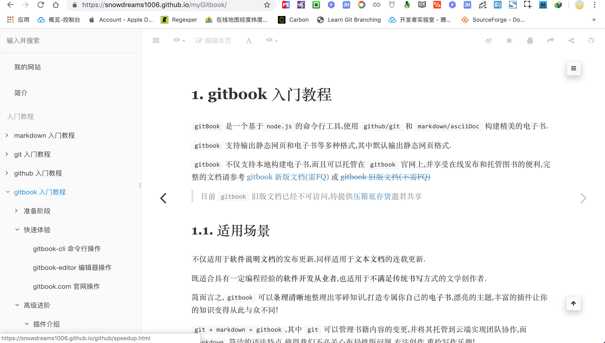

# 简介 

`gitbook-official` 是由**雪之梦技术驿站**整理的旧版 `gitbook` **官方文档**,压箱底存货与君共赏,所有版权归属原作者.

`gitbook` 是一款文档编写工具,用于**漂亮优雅**地构建**电子书**或者发布**静态网站**.

如果你既懂 `markdown` 又熟悉 `git` ,那么使用 `gitbook` 编写文档最合适不过了!

如果你想了解更多关于 `gitbook` 的相关信息,欢迎访问 [gitbook 入门教程](https://snowdreams1006.github.io/myGitbook/) 再决定不晚.

- [原版官方文档](https://snowdreams1006.github.io/gitbook-official/en/)
- [中文官方文档](https://snowdreams1006.github.io/gitbook-official/zh/)

> 如果你觉得**官方文档**过于晦涩难懂,想要通缩易懂地了解 `gitbook` ,那么强烈建议参考 [gitbook 入门教程](https://snowdreams1006.github.io/myGitbook/).

## 版权归属原作者

- [https://github.com/GitbookIO/gitbook](https://github.com/GitbookIO/gitbook)
- [https://github.com/chwshuang/gitbook-site](https://github.com/chwshuang/gitbook-site)

## 雪之梦技术驿站

> gitbook 入门教程 : [https://snowdreams1006.github.io/myGitbook/](https://snowdreams1006.github.io/myGitbook/)

- 微信公众号 

> 名称 : `雪之梦技术驿站`,微信号 : `snowdreams1006` 

关注理由:

开源的不开源的都会发布到微信公众号,不再局限于系列教程而是随性而为,展示真实的技术人生.

- 个人微信号

> 名称 : `雪之梦技术驿站`,微信号 : `snowdreams1109`

适用场景:

如果三言两语很难阐释你遇到的问题,如果你是人见人爱的妹子,那么欢迎加我私人微信一起畅谈人生.

